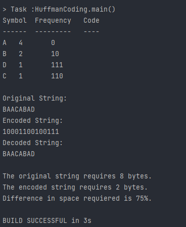

# CIIC4020/ICOM4035: Data Structures - Second Project
# Huffman Coding

## What is this project about?
This project uses the huffman coding algorithm, developed by David A. Huffman, it is an encoding algorithm 
which uses the frequency of each symbol so that the ones that appear most frequent are given shorter codes.

## Implemented Functions:
- compute_fd: Receives a string and computes the frequency of each character.
- huffman-_tree: Receives the frequency distribution map and creates the huffman tree, from the leaves up to the root which it then returns.
- huffman_code: Receives the root of the huffman tree and returns a map with each character's corresponding code.
- encode: Receives the huffman_code map and encodes the given string.

